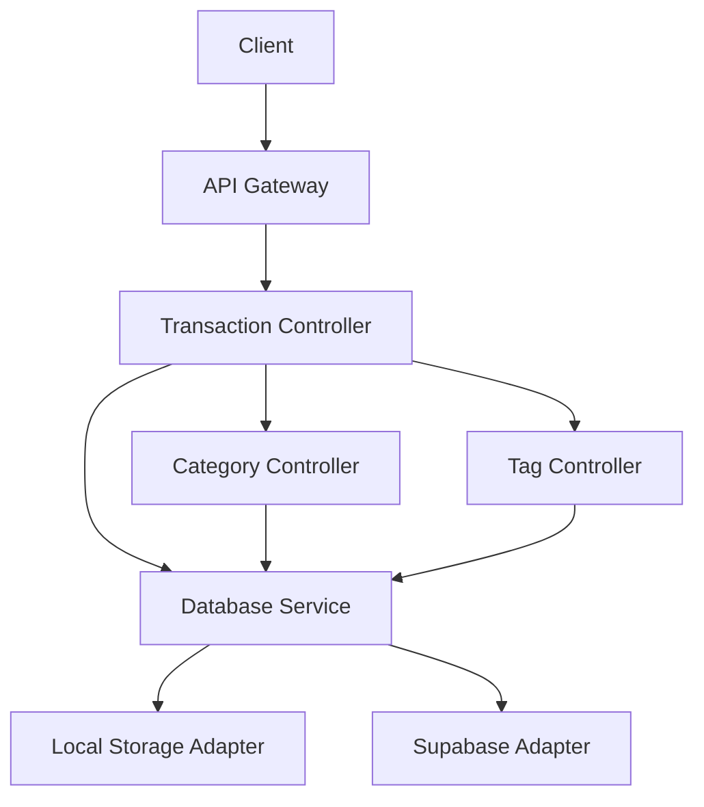

# Financial Planner - Category & Tag Management Master Plan

## 1. Architecture Overview



## 2. Database Schema Design

### Categories Table
```typescript
interface Category {
    id: string;
    name: string;
    parent_id?: string; // For sub-categories
    user_id: string;
    created_at: string;
    updated_at: string;
}
```

### Tags Table
```typescript
interface Tag {
    id: string;
    name: string;
    user_id: string;
    created_at: string;
    updated_at: string;
}
```

### Transaction Tags Table
```typescript
interface TransactionTag {
    transaction_id: string;
    tag_id: string;
}
```

## 3. API Endpoints

### Categories
- `POST /categories` - Create new category
- `GET /categories` - Get all categories
- `GET /categories/:id` - Get category by ID
- `PUT /categories/:id` - Update category
- `DELETE /categories/:id` - Delete category

### Tags
- `POST /tags` - Create new tag
- `GET /tags` - Get all tags
- `PUT /tags/:id` - Update tag
- `DELETE /tags/:id` - Delete tag

### Transaction Tags
- `POST /transactions/:id/tags` - Add tags to transaction
- `DELETE /transactions/:id/tags` - Remove tags from transaction

## 4. Business Logic

### Category Management
- Validate category hierarchy (prevent circular references)
- Cascade delete sub-categories when parent is deleted
- Unique name validation per user

### Tag Management
- Unique name validation per user
- Automatic cleanup of unused tags

### Transaction Splitting
- Allow splitting transaction amount across multiple categories
- Validate total split amount equals transaction amount
- Create child transactions for each split

## 5. Error Handling
- Custom error classes for different scenarios
- Detailed error messages in development mode
- Consistent error response format
```typescript
interface ErrorResponse {
    success: false;
    message: string;
    error?: string; // Only in development
}
```

## 6. Integration
- Extend existing TransactionType interface
```typescript
interface TransactionType {
    // ... existing fields
    category_id: string;
    tags: string[];
    parent_transaction_id?: string; // For split transactions
}
```
- Add new methods to DatabaseService
```typescript
class DatabaseService {
    // ... existing methods
    createCategory(category: Category): Promise<Category>;
    getCategoryTree(userId: string): Promise<Category[]>;
    assignTagsToTransaction(transactionId: string, tagIds: string[]): Promise<void>;
    splitTransaction(transactionId: string, splits: Split[]): Promise<Transaction[]>;
}