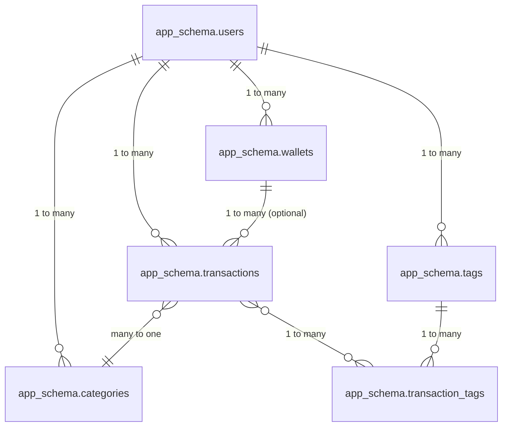

# Database Schema Documentation

## Tables Overview


## Schema: `app_schema`

All tables below reside in the `app_schema`.

### app_schema.users
| Column         | Type         | Constraints               | Description                     |
|----------------|--------------|---------------------------|---------------------------------|
| id             | UUID         | PRIMARY KEY, NOT NULL     | Unique user identifier          |
| email          | text         | UNIQUE, NOT NULL          | User's email address            |
| password_hash  | text         | NOT NULL                  | Hashed password (if local auth) |
| name           | text         |                           | User's full name or display name|
| avatar_url     | text         |                           | URL to user's avatar image      |
| google_id      | text         | UNIQUE                    | Google OAuth unique identifier  |
| phone          | text         |                           | User's phone number             |
| date_of_birth  | date         |                           | User's date of birth            |
| occupation     | text         |                           | User's occupation               |
| monthly_income | numeric      |                           | User's monthly income           |
| financial_goals| text         |                           | User's financial goals          |
| role           | text         | DEFAULT 'user'            | User role (e.g., 'user', 'admin')|
| created_at     | timestamptz  | NOT NULL DEFAULT now()    | Account creation timestamp      |
| updated_at     | timestamptz  | NOT NULL DEFAULT now()    | Last update timestamp           |

### app_schema.wallets
| Column         | Type         | Constraints                    | Description                     |
|----------------|--------------|--------------------------------|---------------------------------|
| id             | UUID         | PRIMARY KEY DEFAULT uuid_generate_v4() | Unique wallet identifier (DB generated) |
| user_id        | UUID         | NOT NULL, REFERENCES app_schema.users(id) | Associated user                 |
| walletId       | TEXT         | NOT NULL UNIQUE                | Frontend compatibility ID / sync ID |
| name           | TEXT         | NOT NULL                       | Wallet name                     |
| type           | TEXT         |                                | Wallet type (e.g., 'Cash', 'Bank', 'E-Wallet') |
| balance        | NUMERIC      | NOT NULL DEFAULT 0             | Current wallet balance          |
| color_hex      | TEXT         |                                | UI color for the wallet         |
| icon_name      | TEXT         |                                | UI icon name for the wallet     |
| created_at     | TIMESTAMPTZ  | NOT NULL DEFAULT now()         | Creation timestamp              |
| updated_at     | TIMESTAMPTZ  | NOT NULL DEFAULT now()         | Last update timestamp           |

### app_schema.transactions
| Column         | Type         | Constraints                        | Description                     |
|----------------|--------------|------------------------------------|---------------------------------|
| id             | UUID         | PRIMARY KEY, NOT NULL DEFAULT uuid_generate_v4() | Unique transaction identifier   |
| user_id        | UUID         | NOT NULL, REFERENCES app_schema.users(id) | Associated user                 |
| wallet_id      | UUID         | REFERENCES app_schema.wallets(id)  | Associated wallet (optional)    |
| amount         | numeric      | NOT NULL                           | Transaction amount              |
| type           | text         | NOT NULL CHECK (type IN ('income', 'expense', 'transfer')) | Transaction type            |
| category_id    | UUID         | REFERENCES app_schema.categories(id) | Transaction category            |
| date           | timestamptz  | NOT NULL                           | Transaction date                |
| description    | text         |                                    | Transaction description         |
| merchant_name  | text         |                                    | Merchant name                   |
| location       | text         |                                    | Transaction location            |
| receipt_id     | text         |                                    | Receipt identifier (if any)     |
| receipt_items  | jsonb        |                                    | Transaction items as JSON (from OCR) |
| note           | text         |                                    | Additional notes (user entered) |
| created_at     | timestamptz  | NOT NULL DEFAULT now()             | Creation timestamp              |
| updated_at     | timestamptz  | NOT NULL DEFAULT now()             | Last update timestamp           |
| sync_status    | text         | DEFAULT 'pending'                  | Sync status with frontend       |
| is_from_receipt| boolean      | DEFAULT false                      | Was this transaction from OCR?  |


### app_schema.categories
| Column         | Type         | Constraints                        | Description                     |
|----------------|--------------|------------------------------------|---------------------------------|
| id             | UUID         | PRIMARY KEY, NOT NULL DEFAULT uuid_generate_v4() | Unique category identifier      |
| user_id        | UUID         | NOT NULL, REFERENCES app_schema.users(id) | Associated user                 |
| name           | text         | NOT NULL                           | Category name                   |
| parent_id      | UUID         | REFERENCES app_schema.categories(id) | Parent category (for hierarchy) |
| created_at     | timestamptz  | NOT NULL DEFAULT now()             | Creation timestamp              |
| updated_at     | timestamptz  | NOT NULL DEFAULT now()             | Last update timestamp           |

### app_schema.tags
| Column         | Type         | Constraints                        | Description                     |
|----------------|--------------|------------------------------------|---------------------------------|
| id             | UUID         | PRIMARY KEY, NOT NULL DEFAULT uuid_generate_v4() | Unique tag identifier           |
| user_id        | UUID         | NOT NULL, REFERENCES app_schema.users(id) | Associated user                 |
| name           | text         | NOT NULL UNIQUE                    | Tag name                        |
| created_at     | timestamptz  | NOT NULL DEFAULT now()             | Creation timestamp              |
| updated_at     | timestamptz  | NOT NULL DEFAULT now()             | Last update timestamp           |

### app_schema.transaction_tags (Join Table)
| Column         | Type         | Constraints                        | Description                     |
|----------------|--------------|------------------------------------|---------------------------------|
| transaction_id | UUID         | NOT NULL, REFERENCES app_schema.transactions(id) ON DELETE CASCADE | Associated transaction |
| tag_id         | UUID         | NOT NULL, REFERENCES app_schema.tags(id) ON DELETE CASCADE    | Associated tag                  |
| PRIMARY KEY (transaction_id, tag_id) |                          |                                    |                                 |

## Supabase Free Tier Considerations

1. **Database Size**: 500MB limit
   - Strategy: Use efficient data types and clean up old data
   
2. **Row Limits**: 50,000 rows per table
   - Strategy: Archive old transactions periodically
   
3. **Storage**: 1GB limit
   - Strategy: Store receipts in external storage when needed

4. **Migration Strategy**
   - Use Supabase's built-in migration tool
   - Create migrations in small, incremental steps
   - Use the following naming convention: `YYYYMMDD_description.sql`
   - Test migrations locally before deploying to production

## Example Migration File (20240702_create_app_schema_and_tables.sql)
```sql
-- Create the schema
CREATE SCHEMA IF NOT EXISTS app_schema;

-- Set search_path for the current session to include app_schema,
-- this allows referencing tables without schema prefix FOR THIS SCRIPT if desired,
-- but explicit prefixing (app_schema.table_name) is safer for clarity in general queries.
-- For Supabase, ensure the role your API uses has app_schema in its search_path
-- or that PostgREST exposes this schema.
-- SET search_path TO app_schema, public;

-- Create app_schema.users table
CREATE TABLE app_schema.users (
    id UUID PRIMARY KEY DEFAULT uuid_generate_v4(),
    email TEXT NOT NULL UNIQUE,
    password_hash TEXT, -- Can be NULL if only OAuth is used
    name TEXT,
    avatar_url TEXT,
    google_id TEXT UNIQUE,
    phone TEXT,
    date_of_birth DATE,
    occupation TEXT,
    monthly_income NUMERIC,
    financial_goals TEXT,
    role TEXT DEFAULT 'user',
    created_at TIMESTAMPTZ NOT NULL DEFAULT NOW(),
    updated_at TIMESTAMPTZ NOT NULL DEFAULT NOW()
);

-- Create app_schema.wallets table
CREATE TABLE app_schema.wallets (
    id UUID PRIMARY KEY DEFAULT uuid_generate_v4(),
    user_id UUID NOT NULL REFERENCES app_schema.users(id) ON DELETE CASCADE,
    walletId TEXT NOT NULL UNIQUE, -- Frontend compatibility ID
    name TEXT NOT NULL,
    type TEXT,
    balance NUMERIC NOT NULL DEFAULT 0,
    color_hex TEXT,
    icon_name TEXT,
    created_at TIMESTAMPTZ NOT NULL DEFAULT NOW(),
    updated_at TIMESTAMPTZ NOT NULL DEFAULT NOW()
);

-- Create app_schema.transactions table
CREATE TABLE app_schema.transactions (
    id UUID PRIMARY KEY DEFAULT uuid_generate_v4(),
    user_id UUID NOT NULL REFERENCES app_schema.users(id) ON DELETE CASCADE,
    wallet_id UUID REFERENCES app_schema.wallets(id) ON DELETE SET NULL, -- Optional wallet link
    amount NUMERIC NOT NULL,
    type TEXT NOT NULL CHECK (type IN ('income', 'expense', 'transfer')),
    category_id UUID REFERENCES app_schema.categories(id) ON DELETE SET NULL,
    date TIMESTAMPTZ NOT NULL,
    description TEXT,
    merchant_name TEXT,
    location TEXT,
    receipt_id TEXT,
    receipt_items JSONB,
    note TEXT,
    is_from_receipt BOOLEAN DEFAULT false,
    created_at TIMESTAMPTZ NOT NULL DEFAULT NOW(),
    updated_at TIMESTAMPTZ NOT NULL DEFAULT NOW(),
    sync_status TEXT DEFAULT 'pending'
);

-- Create app_schema.categories table
CREATE TABLE app_schema.categories (
    id UUID PRIMARY KEY DEFAULT uuid_generate_v4(),
    user_id UUID NOT NULL REFERENCES app_schema.users(id) ON DELETE CASCADE,
    name TEXT NOT NULL,
    parent_id UUID REFERENCES app_schema.categories(id) ON DELETE SET NULL, -- Allow parent to be nullified
    created_at TIMESTAMPTZ NOT NULL DEFAULT NOW(),
    updated_at TIMESTAMPTZ NOT NULL DEFAULT NOW(),
    CONSTRAINT uq_user_category_name UNIQUE (user_id, name, parent_id) -- Ensure unique category names under same parent for a user
);

-- Create app_schema.tags table
CREATE TABLE app_schema.tags (
    id UUID PRIMARY KEY DEFAULT uuid_generate_v4(),
    user_id UUID NOT NULL REFERENCES app_schema.users(id) ON DELETE CASCADE,
    name TEXT NOT NULL,
    created_at TIMESTAMPTZ NOT NULL DEFAULT NOW(),
    updated_at TIMESTAMPTZ NOT NULL DEFAULT NOW(),
    CONSTRAINT uq_user_tag_name UNIQUE (user_id, name) -- Ensure unique tag names per user
);

-- Create app_schema.transaction_tags join table
CREATE TABLE app_schema.transaction_tags (
    transaction_id UUID NOT NULL REFERENCES app_schema.transactions(id) ON DELETE CASCADE,
    tag_id UUID NOT NULL REFERENCES app_schema.tags(id) ON DELETE CASCADE,
    PRIMARY KEY (transaction_id, tag_id)
);

-- Example: Grant usage on schema and select on tables to supabase_auth_admin (or your API role)
-- This is important for Supabase to be able to access the tables via its API.
-- Replace 'your_api_role' with the actual role PostgREST uses (often 'anon' or 'authenticated' or a custom one).
-- GRANT USAGE ON SCHEMA app_schema TO postgres, anon, authenticated;
-- GRANT ALL ON ALL TABLES IN SCHEMA app_schema TO postgres, anon, authenticated;
-- GRANT ALL ON ALL SEQUENCES IN SCHEMA app_schema TO postgres, anon, authenticated;
-- GRANT ALL ON ALL FUNCTIONS IN SCHEMA app_schema TO postgres, anon, authenticated;

-- After running, you might need to refresh PostgREST schema cache if using Supabase dashboard or direct API calls.
-- In Supabase SQL Editor, you can run: NOTIFY pgrst, 'reload schema'