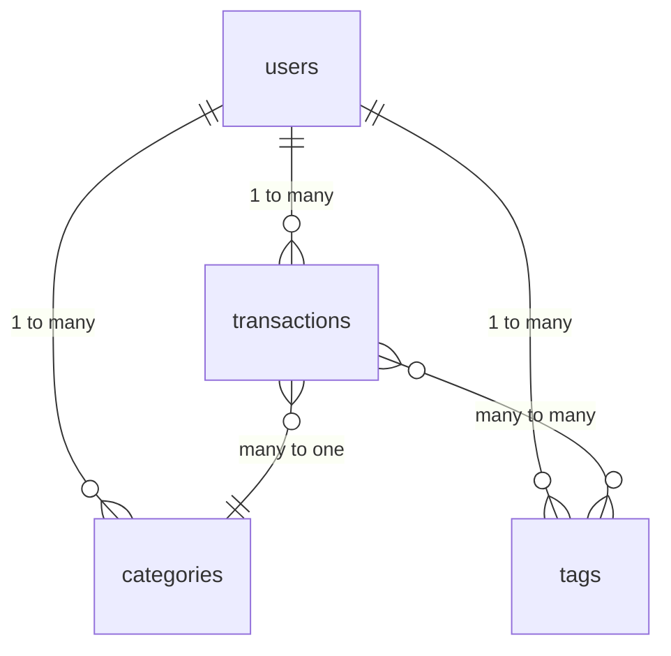

# Database Schema Documentation

## Tables Overview


## Tables Details

### users
| Column         | Type         | Constraints               | Description                     |
|----------------|--------------|---------------------------|---------------------------------|
| id             | UUID         | PRIMARY KEY, NOT NULL     | Unique user identifier          |
| email          | text         | UNIQUE, NOT NULL          | User's email address            |
| password_hash  | text         | NOT NULL                  | Hashed password                 |
| created_at     | timestamptz  | NOT NULL DEFAULT now()    | Account creation timestamp      |
| updated_at     | timestamptz  | NOT NULL DEFAULT now()    | Last update timestamp           |

### transactions
| Column         | Type         | Constraints               | Description                     |
|----------------|--------------|---------------------------|---------------------------------|
| id             | UUID         | PRIMARY KEY, NOT NULL     | Unique transaction identifier   |
| user_id        | UUID         | NOT NULL, REFERENCES users| Associated user                 |
| amount         | numeric      | NOT NULL                  | Transaction amount              |
| type           | text         | NOT NULL                  | 'income' or 'expense'           |
| category_id    | UUID         | REFERENCES categories     | Transaction category            |
| date           | timestamptz  | NOT NULL                  | Transaction date                |
| description    | text         |                           | Transaction description         |
| merchant_name  | text         |                           | Merchant name                   |
| location       | text         |                           | Transaction location            |
| receipt_id     | text         |                           | Receipt identifier              |
| items          | jsonb        |                           | Transaction items as JSON       |
| notes          | text         |                           | Additional notes                |
| tags           | text[]       |                           | Array of tags                   |
| created_at     | timestamptz  | NOT NULL DEFAULT now()    | Creation timestamp              |
| updated_at     | timestamptz  | NOT NULL DEFAULT now()    | Last update timestamp           |
| sync_status    | text         | DEFAULT 'pending'         | Sync status                     |

### categories
| Column         | Type         | Constraints               | Description                     |
|----------------|--------------|---------------------------|---------------------------------|
| id             | UUID         | PRIMARY KEY, NOT NULL     | Unique category identifier      |
| user_id        | UUID         | NOT NULL, REFERENCES users| Associated user                 |
| name           | text         | NOT NULL                  | Category name                   |
| parent_id      | UUID         | REFERENCES categories     | Parent category (for hierarchy) |
| created_at     | timestamptz  | NOT NULL DEFAULT now()    | Creation timestamp              |
| updated_at     | timestamptz  | NOT NULL DEFAULT now()    | Last update timestamp           |

### tags
| Column         | Type         | Constraints               | Description                     |
|----------------|--------------|---------------------------|---------------------------------|
| id             | UUID         | PRIMARY KEY, NOT NULL     | Unique tag identifier           |
| user_id        | UUID         | NOT NULL, REFERENCES users| Associated user                 |
| name           | text         | NOT NULL                  | Tag name                        |
| created_at     | timestamptz  | NOT NULL DEFAULT now()    | Creation timestamp              |
| updated_at     | timestamptz  | NOT NULL DEFAULT now()    | Last update timestamp           |

### transaction_tags (Join Table)
| Column         | Type         | Constraints               | Description                     |
|----------------|--------------|---------------------------|---------------------------------|
| transaction_id | UUID         | NOT NULL, REFERENCES transactions | Associated transaction |
| tag_id         | UUID         | NOT NULL, REFERENCES tags | Associated tag                  |

## Supabase Free Tier Considerations

1. **Database Size**: 500MB limit
   - Strategy: Use efficient data types and clean up old data
   
2. **Row Limits**: 50,000 rows per table
   - Strategy: Archive old transactions periodically
   
3. **Storage**: 1GB limit
   - Strategy: Store receipts in external storage when needed

4. **Migration Strategy**
   - Use Supabase's built-in migration tool
   - Create migrations in small, incremental steps
   - Use the following naming convention: `YYYYMMDD_description.sql`
   - Test migrations locally before deploying to production

## Example Migration File (20240620_create_tables.sql)
```sql
-- Create users table
CREATE TABLE users (
    id UUID PRIMARY KEY DEFAULT uuid_generate_v4(),
    email TEXT NOT NULL UNIQUE,
    password_hash TEXT NOT NULL,
    created_at TIMESTAMPTZ NOT NULL DEFAULT NOW(),
    updated_at TIMESTAMPTZ NOT NULL DEFAULT NOW()
);

-- Create transactions table
CREATE TABLE transactions (
    id UUID PRIMARY KEY DEFAULT uuid_generate_v4(),
    user_id UUID NOT NULL REFERENCES users(id),
    amount NUMERIC NOT NULL,
    type TEXT NOT NULL CHECK (type IN ('income', 'expense')),
    category_id UUID REFERENCES categories(id),
    date TIMESTAMPTZ NOT NULL,
    description TEXT,
    merchant_name TEXT,
    location TEXT,
    receipt_id TEXT,
    items JSONB,
    notes TEXT,
    tags TEXT[],
    created_at TIMESTAMPTZ NOT NULL DEFAULT NOW(),
    updated_at TIMESTAMPTZ NOT NULL DEFAULT NOW(),
    sync_status TEXT DEFAULT 'pending'
);

-- Create categories table
CREATE TABLE categories (
    id UUID PRIMARY KEY DEFAULT uuid_generate_v4(),
    user_id UUID NOT NULL REFERENCES users(id),
    name TEXT NOT NULL,
    parent_id UUID REFERENCES categories(id),
    created_at TIMESTAMPTZ NOT NULL DEFAULT NOW(),
    updated_at TIMESTAMPTZ NOT NULL DEFAULT NOW()
);

-- Create tags table
CREATE TABLE tags (
    id UUID PRIMARY KEY DEFAULT uuid_generate_v4(),
    user_id UUID NOT NULL REFERENCES users(id),
    name TEXT NOT NULL,
    created_at TIMESTAMPTZ NOT NULL DEFAULT NOW(),
    updated_at TIMESTAMPTZ NOT NULL DEFAULT NOW()
);

-- Create transaction_tags join table
CREATE TABLE transaction_tags (
    transaction_id UUID NOT NULL REFERENCES transactions(id),
    tag_id UUID NOT NULL REFERENCES tags(id),
    PRIMARY KEY (transaction_id, tag_id)
);