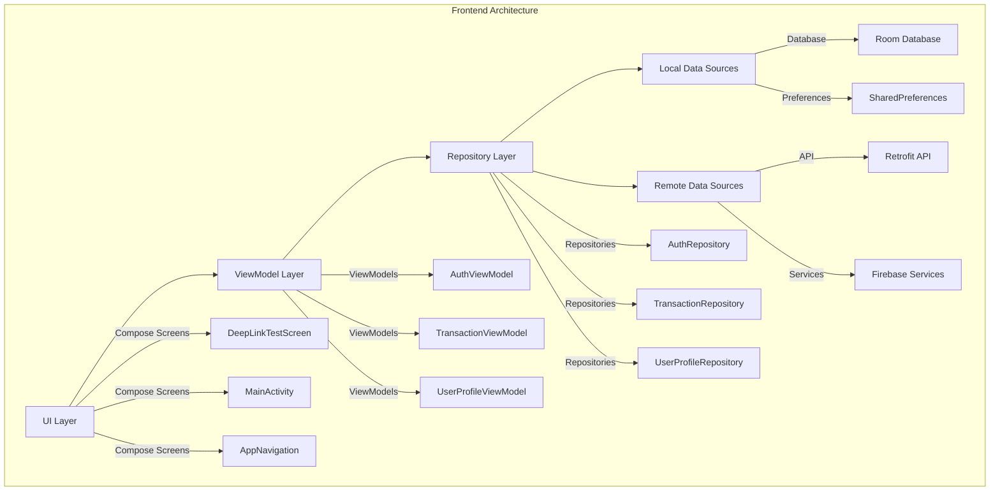
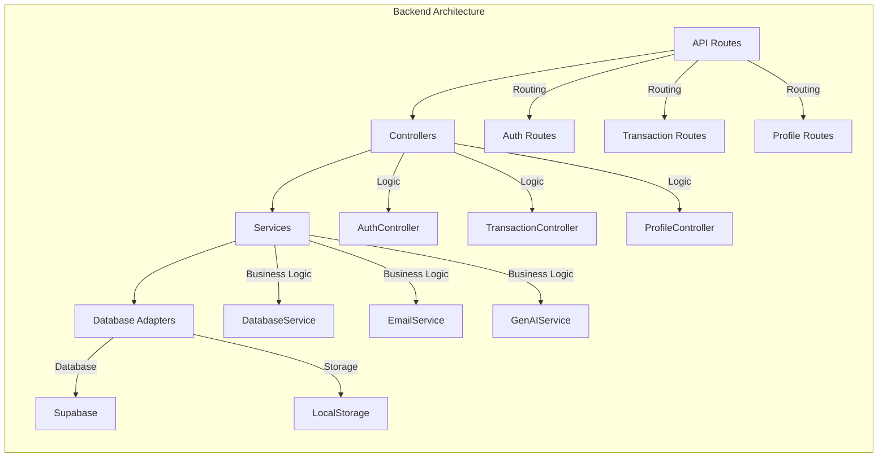
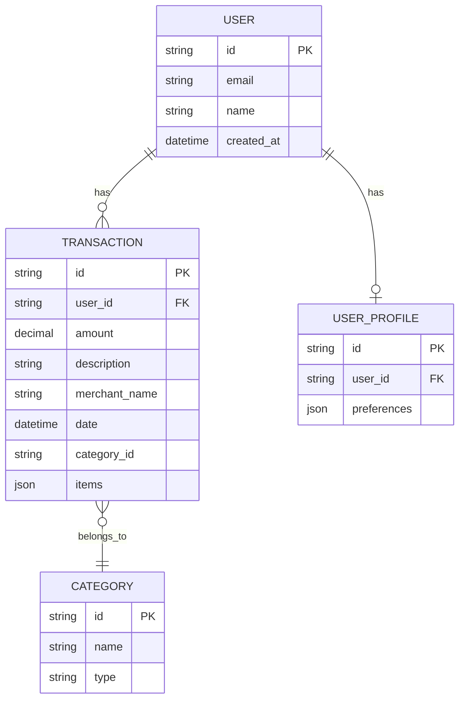

# Financial Planner Architecture Documentation

## Frontend Architecture (Jetpack Compose)

### Key Components:
1. **UI Layer**: Jetpack Compose screens with state hoisting
2. **ViewModel Layer**: Manages UI state and business logic
3. **Repository Layer**: Mediates between data sources
4. **Local Data**: Room DB for transactions, SharedPreferences for tokens
5. **Remote Data**: Retrofit for REST API, Firebase for auth/services

## Backend Architecture (Express.js)

### Key Components:
1. **Routes**: REST API endpoint definitions
2. **Controllers**: Request handling and validation
3. **Services**: Business logic implementation
4. **Adapters**: Database abstraction layer

## Entity Relationship Diagram

### Relationships:
- One User has many Transactions
- One User has one Profile
- Transactions belong to a Category

## Integration Points
1. **Authentication Flow**
   - Token-based auth using JWT
   - TokenManager handles local storage
   - Deep linking for OAuth callbacks

2. **Data Synchronization**
   - Offline-first approach
   - Sync status tracking
   - Conflict resolution

3. **Error Handling**
   - Consistent error formats
   - Global error middleware
   - Logging and monitoring

## Next Steps
1. Implement transaction synchronization logic
2. Add category management to both frontend and backend
3. Develop reconciliation screen for data conflicts