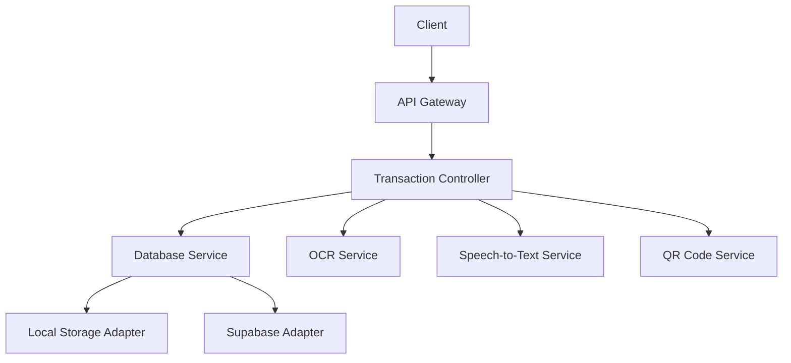
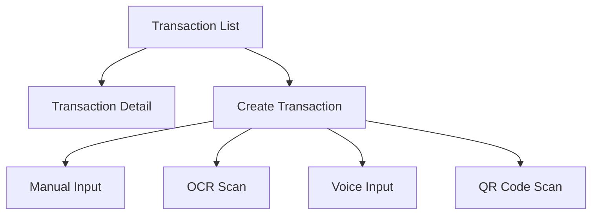

# Transaction Management Implementation Plan

## 1. Backend Architecture

### API Endpoints


### Endpoint Details
- `GET /transactions` - Get transactions with filters (date, category, tag)
- `POST /transactions` - Create new transaction (manual input)
- `POST /transactions/ocr` - Process receipt via OCR
- `POST /transactions/speech` - Process voice input
- `POST /transactions/qr` - Process QR code
- `PUT /transactions/:id` - Update transaction
- `DELETE /transactions/:id` - Delete transaction

## 2. Frontend Architecture (Jetpack Compose)

### Screens


### Components
- TransactionListScreen
- TransactionDetailScreen
- CreateTransactionScreen
- ManualInputForm
- OCRScanner
- VoiceInputComponent
- QRScanner

## 3. Database Schema Updates

### Transactions Table
```typescript
interface Transaction {
    id: string;
    user_id: string;
    amount: number;
    type: 'expense' | 'income';
    category_id: string;
    date: string;
    description?: string;
    merchant_name?: string;
    location?: string;
    receipt_id?: string;
    items?: any[];
    notes?: string;
    tags?: string[];
    created_at: string;
    updated_at: string;
    sync_status: 'synced' | 'pending' | 'error';
}
```

## 4. Implementation Phases

### Phase 1: Core Transaction Management
- Implement CRUD operations
- Add filtering capabilities
- Create basic UI components

### Phase 2: Input Methods
- Implement manual input form
- Add OCR scanning capability
- Add voice input support
- Add QR code scanning

### Phase 3: Offline/Online Sync
- Implement local storage adapter
- Add sync status tracking
- Create sync mechanism

## 5. Technology Stack

### Backend
- Node.js/Express
- Supabase/PostgreSQL
- OCR API (Tesseract/Google Vision)
- Speech-to-Text API (Google/Whisper)
- QR Code parsing library

### Frontend
- Jetpack Compose
- CameraX for image capture
- ML Kit for on-device OCR
- Speech Recognizer API
- ZXing for QR scanning

Would you like me to proceed with this plan or make any modifications?